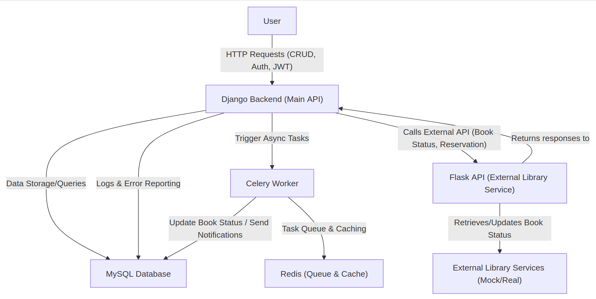

# Library Reservation System

This project is a system for managing library book reservations. It consists of multiple components:
- **Django Backend**: Main API for managing books, users, and reservations.
- **Flask API**: External service that provides book status information and accepts reservation data.
- **MySQL Database**: Stores data for books, users, reservations, and system logs.
- **Redis**: Used for caching, session storage, and task queue management.
- **Celery Workers**: Handle asynchronous tasks such as updating book statuses and sending overdue notifications.

## Table of Contents

- [Architecture Diagram](#architecture-diagram)
- [Prerequisites](#prerequisites)
- [Local Setup](#local-setup)
- [Configuration](#configuration)
- [Running the Application](#running-the-application)
- [Running Asynchronous Tasks](#running-asynchronous-tasks)
- [Testing](#testing)
- [Docker Commands (Makefile)](#docker-commands)
- [API Documentation](#api-documentation)
- [License](#license)

## Architecture Diagram

The system architecture is illustrated in the diagram below. The PNG file `diagram.png` shows how the components communicate:




## Prerequisites

Before running the application, ensure you have the following installed:

- [Docker](https://docs.docker.com/get-docker/)
- [Docker Compose](https://docs.docker.com/compose/install/)

## Local Setup

1. **Clone the Repository**

   ```bash
   git clone https://github.com/Sylwia0506/library.git
   cd library
   ```
   
   2. **Directory Structure Overview**

       ```bash
          library/
        ├── api/                     # Flask API service
        │   ├── Dockerfile
        │   ├── requirements.txt
        │   └── src/
        │       └── ...              # Flask application code
        ├── backend/                 # Django backend service
        │   ├── config/              # Django settings, urls, wsgi, celery config, etc.
        │   ├── library_app/         # Django app containing models, views, serializers, tasks, etc.
        │   ├── Dockerfile
        │   ├── manage.py
        │   ├── requirements.txt
        │   └── ... 
        ├── db/                      # Database initialization scripts
        │   └── init.sql
        ├── docker/                  # Docker Compose and additional docker configs
        │   └── docker-compose.yml
        ├── Makefile                 # Make commands for building, starting, and testing containers
        └── README.md                # This file
     ```
   
## Configuration

The system uses environment variables for configuration. Key variables include:

- Django/Backend:
    - DJANGO_SETTINGS_MODULE (default: config.settings)
    - MYSQL_DATABASE, MYSQL_USER, MYSQL_PASSWORD, MYSQL_HOST, MYSQL_PORT
    - REDIS_HOST, REDIS_PORT, REDIS_DB
    - DJANGO_SECRET_KEY
- Flask/API:
    - FLASK_APP (default: src/run.py)
    - FLASK_ENV (default: development)
    - LIBRARY_API_URL (endpoint for the backend API)
    - LIBRARY_AUTH_URL (endpoint for authentication)

You can set these variables in your shell or within the Docker Compose file under the environment section for each service.

## Running the Application

The project uses Docker Compose to orchestrate the services. From the root of the repository, run:

```bash
make up
```

This command will:

- Build and start the containers for the Django backend, Flask API, MySQL database, Redis, and Celery worker.
- Execute Django migrations.
- Collect static files for the backend.

To stop the services, run:

```bash
make down
```

## Running Asynchronous Tasks

The Django backend uses Celery for background tasks (e.g., updating book statuses, sending overdue notifications).

- Starting Celery Worker:
    - The Celery worker is managed by Docker Compose. It starts automatically when you run make up as defined in the Compose file:

    ```yml
    celery:
      command: celery -A config worker -l info
    ```
  
- Debugging Celery Tasks:
  - You can inspect task logs using:

    ```bash
    make logs
    ```
    
## Testing

- The repository includes both unit and integration tests.
  - API Tests:
   ```bash
  make test-api
  ```
  - Backend Tests:
  ```bash
  make test-backend
  ```
  
## Docker Commands (Makefile)

The provided Makefile includes common commands:

- make build – Build Docker images.
- make up – Start all containers.
- make down – Stop all containers.
- make restart – Restart all containers.
- make logs – Tail logs from all containers.
- make migrate – Run Django migrations.
- make createsuperuser – Create a Django superuser.
- make shell-backend – Open a shell in the backend container.
- make shell-api – Open a shell in the API container.
- make shell-db – Open a MySQL shell in the database container.
- make clean – Remove containers, volumes, and temporary files.

API Documentation

The project uses Swagger (via drf-yasg) for API documentation.

- Swagger UI:
Accessible at: http://localhost:8000/swagger/, http://localhost:5000/swagger/

- ReDoc:
Accessible at: http://localhost:8000/redoc/

## License

This project is licensed under the MIT License.
